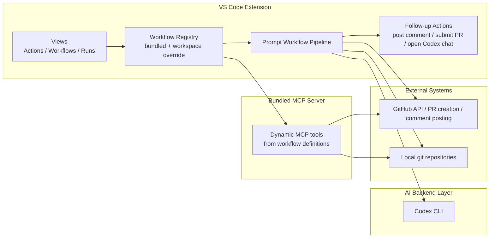
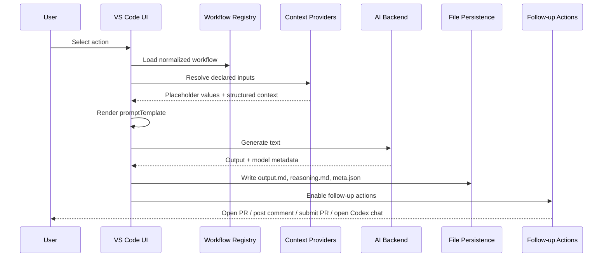

# CMSIS-Dev MVP Architecture

## Scope

This document describes the current MVP as implemented in the VS Code extension and bundled MCP server.

Two boundaries are important:

- Workflow registration is currently local: bundled workflows shipped with the extension, plus optional workspace overrides.
- GitHub is currently a context source and execution target, not a remote workflow registry.

That distinction matters for extensibility: adding workflows from a GitHub repository is not a first-class feature yet, but the current registry design leaves a clear insertion point for it.

## Architecture Overview

CMSIS-Dev has three runtime layers:

1. The VS Code extension owns UI, workflow discovery, input collection, prompt construction, AI execution, output persistence, and follow-up actions.
2. The MCP server exposes the same workflow catalog as MCP tools, resolving supported inputs and returning rendered prompts.
3. The AI backend layer is currently Codex-focused: the extension executes actions through Codex CLI using the configured model and reasoning effort.



## Core Design

The central abstraction is `WorkflowDefinition`. A workflow is data, not code: the extension reads YAML, normalizes it, and drives both the VS Code action list and the MCP tool list from that shared definition.

That gives the MVP a simple separation of concerns:

- Workflow files define intent: inputs, prompt template, follow-ups.
- The extension implements interaction and execution.
- The MCP server implements tool exposure for the same workflow set.
- GitHub and local git integrations are context providers rather than workflow-specific logic.

## VS Code Extension Layer

The extension entrypoint is `src/extension.ts`. It wires together four responsibilities:

- View registration: `ActionsProvider`, `WorkflowsProvider`, and `RunsProvider`.
- Commands: run action, refresh, create overrides, follow-up actions, token management, delete runs.
- Watchers and diagnostics: workflow file watchers, runs watcher, YAML validation.
- MCP process hosting: starts `out/mcp/server.js` as a child process and passes the paths it needs via environment variables.

The UI surface is intentionally thin:

- `ActionsProvider` shows runnable workflows loaded from the registry.
- The `Actions` view title exposes Codex model and reasoning controls and shows the effective selection as view description text.
- `WorkflowsProvider` shows the effective workflow files, labeled as `installed` or `workspace`.
- `RunsProvider` shows generated outputs from the runs directory and supports multi-select deletion.

This keeps the views declarative. They render the current model but do not own workflow semantics.

## MCP Server Layer

The MCP server lives in `src/mcp/server.ts`. On startup it:

1. Resolves the bundled workflow directory.
2. Resolves the optional workspace override path.
3. Loads and merges both sets of workflows.
4. Registers one MCP tool per compatible workflow.

Each registered tool:

- derives its input schema from the workflow input list,
- resolves supported context inputs,
- renders `promptTemplate`,
- returns the rendered prompt as MCP text output.

The MCP server is intentionally narrower than the extension. It does not run models, persist output files, or perform VS Code follow-up actions. Its job is prompt materialization and tool exposure.

## AI Backend Layer

The AI backend is an adapter boundary inside `src/workflows/promptWorkflow.ts`.

Current execution logic:

- `tryGenerateWithCodexCli()` runs `codex exec`.
- Codex model and reasoning effort are configured independently of workflow YAML.
- The `Actions` view exposes those controls without changing workflow definitions.

This isolates model execution from workflow definition. A workflow does not know which concrete Codex model has been selected for the run.

That is the main model-plugging extension point in the MVP: add another backend adapter that accepts a prompt and returns generated text plus model metadata, then insert it into the same execution pipeline.

## Workflow Registry

### Current registry sources

The workflow registry is implemented in `src/workflowConfig.ts`.

The effective registry is:

- bundled workflows in `.cmsis-dev/workflows/` inside the extension installation,
- optionally overridden by workspace files in `.cmsis-dev/workflows/`,
- with legacy support for `.cmsis-dev/workflows.yml`.

Merge rule:

- Workflows are keyed by `id`.
- A workspace workflow with the same `id` replaces the bundled one.

Normalization then fills in required defaults for the built-in workflow types such as `review-pr`, `review-changes`, `create-pr`, and `explain-issue`.

### Why this matters

This gives two useful sharing modes:

- Extension-wide shared actions: bundled workflows travel with the extension version.
- Team-wide repo actions: workspace overrides live in the repository and can be versioned with source code.

### GitHub-hosted workflows

The MVP does not yet load workflows directly from GitHub. If that is added, the clean insertion point is another loader that returns `WorkflowDefinition[]` and participates in the merge before workspace overrides are applied.

A likely precedence order would be:

1. installed
2. GitHub-shared
3. workspace override

The existing merge-by-`id` logic already matches that model.

## Action Definition Schema

The contract for workflow files is intentionally small:

```ts
export interface WorkflowDefinition {
  id: string;
  title: string;
  description: string;
  type: string;
  inputs: WorkflowInputDefinition[];
  promptTemplate?: string;
  openCodexChatPromptTemplate?: string;
  followUps?: WorkflowFollowUp[];
}
```

Supported input types:

- `text`
- `github-pr-context`
- `github-issue-context`
- `git-local-changes-context`

Supported follow-ups:

- `openReasoning`
- `openPr`
- `openIssue`
- `postComment`
- `submitPr`
- `openCodexChat`

The YAML schema is enforced in `src/workflowDiagnostics.ts`, which validates open workflow documents and surfaces errors as VS Code diagnostics.

## Context Providers

Context resolution is concentrated in `runPromptWorkflow()` and its helpers in `src/workflows/promptWorkflow.ts`.

Each input type maps to a provider:

- `text`: prompts the user directly.
- `github-pr-context`: selects a PR, fetches PR metadata and file patches, and injects placeholders.
- `github-issue-context`: selects an issue, fetches issue metadata, comments, and linked references.
- `git-local-changes-context`: selects a local repository, resolves the default branch, computes diffs, reads PR templates, and reuses the latest local review when relevant.

These providers isolate external data collection from prompt construction. The prompt renderer only sees a flat `Record<string, string>`.

That flat-value contract is a strong design choice for an MVP:

- workflow YAML stays simple,
- templates stay string-based,
- new providers can be added without changing the renderer.

## Backend Adapters

The execution pipeline depends on one narrow generated-output shape:

```ts
interface GeneratedReview {
  agentName: string;
  modelName: string;
  content: string;
}
```

As long as a backend adapter can return that structure, it can plug into the current pipeline.

That keeps backend-specific details isolated:

- CLI argument construction, process spawning, and event parsing stay inside `tryGenerateWithCodexCli()`,
- the rest of the system only consumes normalized text plus metadata.

## Execution Pipeline

The extension execution lifecycle is:



### Step-by-step

1. A workflow is selected from the actions view or command palette.
2. The workflow definition is loaded from the effective registry.
3. Declared inputs are resolved one by one.
4. Placeholder values are merged into a flat map.
5. `promptTemplate` is rendered.
6. The selected AI backend generates output.
7. The extension writes the user-facing output markdown, a reasoning sidecar, and a metadata sidecar.
8. Follow-up actions are derived from workflow metadata and current context.

## Prompt Construction

Prompt construction is deliberately dumb and predictable:

```ts
function renderPromptTemplate(template: string, values: Record<string, string>): string {
  return template.replace(/\{\{\s*([a-zA-Z0-9_.-]+)\s*\}\}/g, (_full, key) => values[key] ?? "");
}
```

That simplicity is useful for workflow authors:

- no embedded code in workflow files,
- no hidden execution model,
- no workflow-specific renderer branching.

The tradeoff is that complex templating logic must be expressed either as a richer context provider or as prompt wording.

## Output Model and Follow-ups

Each run produces three related files:

- `<output>.md`
- `<output>.md.reasoning.md`
- `<output>.md.meta.json`

The markdown output is now the source of truth for user-editable follow-ups:

- `Post Comment` posts the current markdown output content.
- `Submit PR` parses the current markdown output content into PR title and body.

That design is important because it lets the user edit the generated `.md` file before publishing anything externally.

## How Abstractions Isolate Concerns

`WorkflowDefinition`

- isolates action intent from execution code.

Input providers

- isolate GitHub and git access from prompt rendering.

Prompt rendering

- isolates template expansion from context collection and model execution.

Backend adapters

- isolate model-specific transport details from workflow behavior.

Metadata sidecars

- isolate execution state and follow-up context from the visible markdown output.

MCP tool registration

- isolates workflow exposure for external clients from the VS Code UI.

## Extensibility

### Add a new workflow

The lowest-friction extension point is a new workflow YAML file.

Example:

```yaml
id: summarize-issue
title: Summarize Issue
description: Produce a concise issue summary for a developer joining the work.
type: summarize-issue
followUps:
  - openReasoning
  - openIssue
inputs:
  - id: issue
    label: GitHub Issue
    type: github-issue-context
    required: true
promptTemplate: |
  Summarize this issue for a developer who is new to the codebase.

  Repository: {{owner}}/{{repo}}
  Issue: #{{issueNumber}} {{issueTitle}}

  Description:
  {{issueBody}}

  Comments:
  {{issueComments}}
```

Place it in:

- bundled defaults: `.cmsis-dev/workflows/` in the extension project,
- or workspace override: `<repo>/.cmsis-dev/workflows/`.

No `package.json` command wiring is required. The action appears automatically after reload or refresh.

### Add a new AI model or agent

Add a new backend adapter beside `tryGenerateWithCodexCli()` that:

- accepts a rendered prompt,
- returns normalized generated text,
- reports agent and model names.

The rest of the pipeline does not need to change if the adapter conforms to the current generated-output contract.

### Add a new context source

Add a new `WorkflowInputDefinition.type`, then implement three pieces:

1. schema validation in `workflowDiagnostics.ts`
2. input resolution in `promptWorkflow.ts`
3. MCP schema and resolution in `mcp/server.ts`

This is the main place where the extension and MCP server must stay aligned.

### Add a new tool or team-shared source

For team-wide actions, the current solution is repository-managed workspace workflows. For organization-wide shared actions outside the extension package, add another workflow loader that reads from a shared source and merges into the registry before workspace overrides.

## MCP and VS Code Communication

The extension starts the MCP server as a child Node process and passes it file-system context through environment variables:

- `CMSIS_DEV_EXTENSION_PATH`
- `CMSIS_DEV_WORKSPACE_WORKFLOW_CONFIG`
- `CMSIS_DEV_WORKFLOW_RUNS_DIR`

This is intentionally loose coupling:

- the extension remains the process supervisor,
- the MCP server resolves its own effective workflow set,
- both sides share the workflow shape but do not share in-memory state.

That makes the MCP server independently testable and keeps the boundary simple: file paths and stdio.

## Developer Notes

### Where to look

- `src/extension.ts`: extension composition, commands, watchers, MCP hosting
- `src/workflowConfig.ts`: workflow loading, merge rules, normalization, runs path resolution
- `src/workflows/promptWorkflow.ts`: input collection, prompt rendering, backend execution, follow-ups
- `src/mcp/server.ts`: MCP tool registration and prompt materialization
- `src/workflowDiagnostics.ts`: workflow schema validation
- `src/github.ts`: GitHub API access and workspace repo discovery

### Current MVP constraints

- Workflow templating is string replacement only.
- MCP tools return prompts; they do not execute models.
- Only the extension persists runs and performs follow-up actions.
- Direct GitHub-hosted workflow registries are not implemented yet.

These are reasonable MVP constraints because they keep the workflow contract stable while leaving the main seams for future growth already visible.
